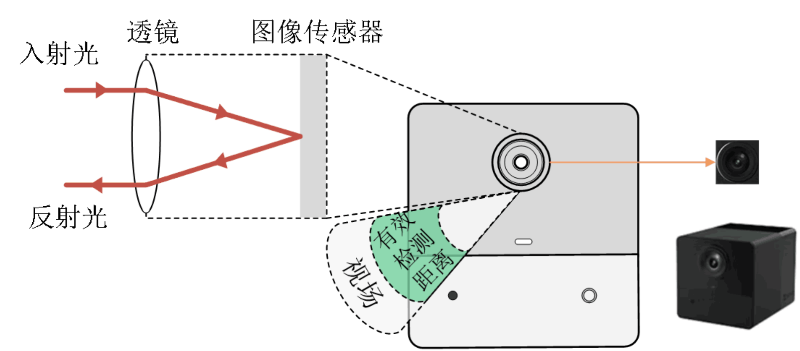
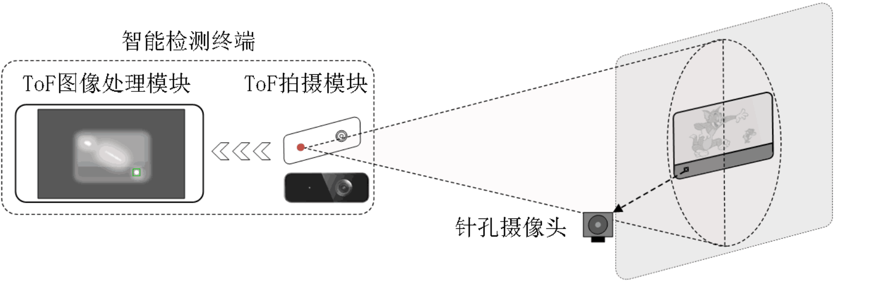
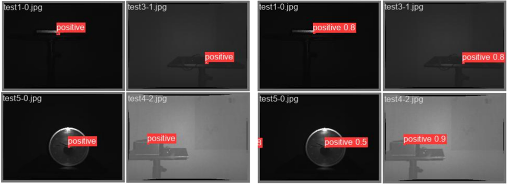

# Lightweight ToF-Based Hidden Camera Detection

This project fine-tunes YOLOv5 to detect hidden or pinhole-camera cues from Time-of-Flight (ToF) sensor data. The approach uses active infrared ToF imaging to capture bright lens reflections, then runs an object detector to localize suspected cameras and report confidence scores.



## Technical Overview

The system is organized as an intelligent detection terminal with two modules:

- ToF capture module: illuminates the target area and collects ToF optical/depth imagery.
- ToF image processing module: runs a trained object detection model on the captured ToF image.

ToF imaging actively emits modulated infrared light and measures reflected light. It is less sensitive to natural light than visible-light inspection, supports high frame rates, and can be deployed on embedded or mobile devices with ToF sensors.

Pinhole camera lenses and image sensors tend to produce strong retro-reflection, often described as a cat-eye reflection. When the detector is inside the camera field of view and at a suitable distance, the lens appears as a bright optical spot. YOLOv5 is trained to distinguish that spot from other reflective objects.

## Detection Workflow



1. Capture a suspected area with the ToF module.
2. Feed the ToF image into YOLOv5.
3. Output candidate boxes, class labels, and confidence scores.
4. Treat detections above `0.5` confidence as positive candidates.
5. If one view cannot cover the full target area, move the detector horizontally or vertically while keeping distance and camera orientation roughly stable. Scan in a `Z` or `S` route until the area is covered.

The preserved experiment output below shows four test scenes. The left side marks actual positive locations, and the right side shows model predictions with confidence scores.



## Repository Layout

```text
.
|-- configs/
|   `-- spycamera.yaml                 # YOLOv5 dataset config
|-- data/
|   |-- yolo/                          # YOLO-ready training and test dataset
|   |   |-- images/train/
|   |   |-- images/test/
|   |   |-- labels/train/
|   |   `-- labels/test/
|   |-- tof_triplets/                  # curated RGB, RGB-color, and Depth triplets
|   `-- raw_tof/                       # original ToF captures and source annotations
|-- docs/assets/                       # diagrams and README figures
|-- experiments/train_exp17/           # preserved metrics and plots
|-- models/
|   `-- spycamera_yolov5s_best.pt      # fine-tuned checkpoint
`-- third_party/yolov5/                # trimmed YOLOv5 training/inference code
```

## Dataset

Classes:

```text
0: positive
1: negative
```

The training-ready dataset is in `data/yolo`. Labels use YOLO text format:

```text
class_id x_center y_center width height
```

The raw ToF captures in `data/raw_tof` preserve the original collection layout. Each capture generally contains `RGB`, `RGB color`, `IR`, `Depth`, and original annotation files.

## Setup

Create an environment and install YOLOv5 dependencies:

```bash
cd third_party/yolov5
python -m venv .venv
source .venv/bin/activate
pip install -r requirements.txt
```

If you already have a PyTorch/CUDA environment, install the requirements there instead.

## Training

Run from `third_party/yolov5`:

```bash
python train.py \
  --img 640 \
  --batch 16 \
  --epochs 300 \
  --data ../../configs/spycamera.yaml \
  --weights yolov5s.pt \
  --name spycamera_yolov5s
```

Adjust `--batch` for GPU memory. New training outputs are written to `third_party/yolov5/runs/train/`.

## Validation

```bash
cd third_party/yolov5
python val.py \
  --data ../../configs/spycamera.yaml \
  --weights ../../models/spycamera_yolov5s_best.pt \
  --img 640
```

The preserved best run is stored in `experiments/train_exp17/`. Its final row reports approximately:

- precision: `0.97582`
- recall: `0.96888`
- mAP@0.5: `0.97618`
- mAP@0.5:0.95: `0.67093`

## Inference

Run inference on the test set:

```bash
cd third_party/yolov5
python detect.py \
  --weights ../../models/spycamera_yolov5s_best.pt \
  --source ../../data/yolo/images/test \
  --img 640 \
  --conf 0.25
```

For a single image, replace `--source` with that image path.

## Cleanup Scope

This repository keeps the files needed to understand, train, validate, and run the ToF hidden-camera detector. Unrelated framework experiments, IDE metadata, caches, duplicate labels, archive files, YOLO cloud/service integrations, and old generated run directories were removed.
